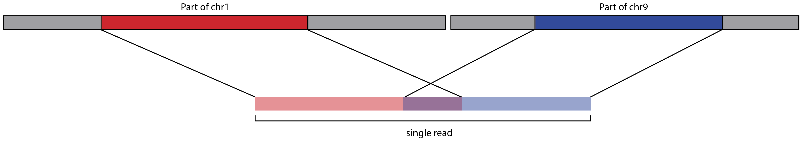

<h1 align="center"></h1>
<h1 align="center">pbmm2</h1>
<p align="center">A minimap2 SMRT wrapper for PacBio data:
native PacBio data in ⇨ native PacBio BAM out.</p>

***

_pbmm2_ is a SMRT C++ wrapper for [minimap2](https://github.com/lh3/minimap2)'s C API.
Its purpose is to support native PacBio in- and output, provide sets of
recommended parameters, generate sorted output on-the-fly, and postprocess alignments.
Sorted output can be used directly for polishing using GenomicConsensus,
if BAM has been used as input to _pbmm2_.
Benchmarks show that _pbmm2_ outperforms BLASR in mapped concordance,
number of mapped bases, and especially runtime. _pbmm2_ is the official
replacement for BLASR.

## Availability
Latest version can be installed via bioconda package `pbmm2`.

Please refer to our [official pbbioconda page](https://github.com/PacificBiosciences/pbbioconda)
for information on Installation, Support, License, Copyright, and Disclaimer.

## Latest Version
Version **1.1.0**: [Full changelog here](#full-changelog)

## Usage
_pbmm2_ offers following tools

```
Tools:
    index      Index reference and store as .mmi file
    align      Align PacBio reads to reference sequences
```

### Typical workflows
```
A. Generate index file for reference and reuse it to align reads
  $ pbmm2 index ref.fasta ref.mmi
  $ pbmm2 align ref.mmi movie.subreads.bam ref.movie.bam

B. Align reads and sort on-the-fly, with 4 alignment and 2 sort threads
  $ pbmm2 align ref.fasta movie.subreads.bam ref.movie.bam --sort -j 4 -J 2

C. Align reads, sort on-the-fly, and create PBI
  $ pbmm2 align ref.fasta movie.subreadset.xml ref.movie.alignmentset.xml --sort

D. Omit output file and stream BAM output to stdout
  $ pbmm2 align hg38.mmi movie1.subreadset.xml | samtools sort > hg38.movie1.sorted.bam

E. Align CCS fastq input and sort output
  $ pbmm2 align ref.fasta movie.Q20.fastq ref.movie.bam --preset CCS --sort --rg '@RG\tID:myid\tSM:mysample'
```

### Index
Indexing is optional, but recommended it you use the same reference with the same `--preset` multiple times.
```
Usage: pbmm2 index [options] <ref.fa|xml> <out.mmi>
```

**Notes:**
 - If you use an index file, you can't override parameters `-k`, `-w`, nor `-u` in `pbmm2 align`!
 - Minimap2 parameter `-H` (homopolymer-compressed k-mer) is always on for _SUBREAD_ and _UNROLLED_ presets and can be disabled with `-u`.
 - You can also use existing minimap2 `.mmi` files in `pbmm2 align`.

### Align
The output argument is optional. If not provided, BAM output is streamed to stdout.
```
Usage: pbmm2 align [options] <ref.fa|xml|mmi> <in.bam|xml|fa|fq> [out.aligned.bam|xml]
```

#### Alignment Parallelization
The number of alignment threads can be specified with `-j,--alignment-threads`.
If not specified, the maximum number of threads will be used, minus one thread for BAM IO
and minus the number of threads specified for sorting.

#### Sorting
Sorted output can be generated using `--sort`.

**Percentage:** By default, 25% of threads specified with `-j`, maximum 8, are used for sorting. Example: `--sort -j 12`, 9 threads for alignment, 3 threads for sorting.

**Manual override:** To override the default percentage, `-J,--sort-threads` defines the explicit number of threads
used for on-the-fly sorting. Example: `--sort -j 12 -J 4`, 12 threads for alignment, 4 threads for sorting.

The memory allocated per sort thread can be defined with `-m,--sort-memory`, accepting suffixes `M,G`.

Benchmarks on human data have shown that 4 sort threads are recommended, but no more
than 8 threads can be effectively leveraged, even with 70 cores used for alignment.
It is recommended to provide more memory to each of a few sort threads, to avoid disk IO pressure,
than providing less memory to each of many sort threads.

#### Input file types

Following compatibility table shows allowed input file types, output file types,
compatibility with GenomicConsensus, and recommended `--preset` choice.
More info about our [dataset XML specification](https://pacbiofileformats.readthedocs.io/en/5.1/DataSet.html).

| Input                                     | Output                                 |GC | Preset   |
| ------------------------------------------| -------------------------------------- |:-:| :------: |
| `.bam` (aligned or unaliged)              | `.bam`                                 | Y |          |
| `.fasta` / `.fa` / `.fasta.gz` / `.fa.gz` | `.bam`                                 | N |          |
| `.fastq` / `.fq` / `.fastq.gz` / `.fq.gz` | `.bam`                                 | N |          |
| `.Q20.fastq` / `Q20.fastq.gz`             | `.bam`                                 | N | `CCS`    |
| `bam.fofn`                                | `.bam`                                 | N |          |
| `fasta.fofn`                              | `.bam`                                 | N |          |
| `fastq.fofn`                              | `.bam`                                 | N |          |
| `.subreadset.xml`                         | `.bam` \ `.alignmentset.xml`           | Y |          |
| `.consensusreadset.xml`                   | `.bam` \ `.consensusalignmentset.xml`  | Y | `CCS`    |
| `.transcriptset.xml`                      | `.bam` \ `.transcriptalignmentset.xml` | Y | `ISOSEQ` |

#### FASTA/Q input
In addition to native PacBio BAM input, reads can also be provided in FASTA
and FASTQ formats, as shown above.

With FASTA/Q input, option `--rg` sets the read group. Example call:

```
pbmm2 align hg38.fasta movie.Q20.fastq hg38.movie.bam --preset CCS --rg '@RG\tID:myid\tSM:mysample'
```

All three reference file formats `.fasta`, `.referenceset.xml`, and `.mmi` can be combined with FASTA/Q input.

#### Multiple input files
_pbmm2_ supports the `.fofn` file type (File Of File Names), containing the same
datatype. Supported are `.fofn` files with FASTA, FASTQ, or BAM.

**Examples:**
```
echo "m64001_190131_212703.Q20.fastq.gz" > myfiles.fofn
echo "m64001_190228_200412.Q20.fastq.gz" >> myfiles.fofn
pbmm2 align hg38.fasta myfiles.fofn hg38.myfiles.bam --preset CCS --rg '@RG\tID:myid\tSM:mysample'
```

```
ls *.subreads.bam > mymovies.fofn
pbmm2 align hg38.fasta mymovies.fofn hg38.mymovies.bam
```

## FAQ

### Which minimap2 version is used?
Minimap2 version 2.15 is used, to be specific, SHA1 [c404f49](https://github.com/lh3/minimap2/commit/c404f49569fa2d606b652418ffa4b9743bcaf641).

### When are `pbi` files created?
Whenever the output is of type `xml`, a `pbi` file is being generated.

### When are `bai` files created?
For sorted output via `--sort`, a `bai` file is being generated.
You can skip BAI generation with `--no-bai`.

### What are parameter sets and how can I override them?
Per default, _pbmm2_ uses recommended parameter sets to simplify the plethora
of possible combinations. For this, we currently offer:

```
  --preset  Set alignment mode:
             - "SUBREAD" -k 19 -w 10 -o 5 -O 56 -e 4 -E 1 -A 2 -B 5 -z 400 -Z 50 -r 2000 -L 0.5
             - "CCS" -k 19 -w 10 -u -o 5 -O 56 -e 4 -E 1 -A 2 -B 5 -z 400 -Z 50 -r 2000 -L 0.5
             - "ISOSEQ" -k 15 -w 5 -u -o 2 -O 32 -e 1 -E 0 -A 1 -B 2 -z 200 -Z 100 -C 5 -r 200000 -G 200000 -L 0.5
             - "UNROLLED" -k 15 -w 15 -o 2 -O 32 -e 1 -E 0 -A 1 -B 2 -z 200 -Z 100 -r 2000 -L 0.5
            Default ["SUBREAD"]
```

If you want to override any of the parameters of your chosen set,
please use the respective options:

```
  -k   k-mer size (no larger than 28). [-1]
  -w   Minimizer window size. [-1]
  -u   Disable homopolymer-compressed k-mer (compression is active for SUBREAD & UNROLLED presets).
  -A   Matching score. [-1]
  -B   Mismatch penalty. [-1]
  -z   Z-drop score. [-1]
  -Z   Z-drop inversion score. [-1]
  -r   Bandwidth used in chaining and DP-based alignment. [-1]
```

For the piece-wise linear gap penalties, use the following overrides, whereas
a k-long gap costs min{o+k*e,O+k*E}:

```
  -o,--gap-open-1     Gap open penalty 1. [-1]
  -O,--gap-open-2     Gap open penalty 2. [-1]
  -e,--gap-extend-1   Gap extension penalty 1. [-1]
  -E,--gap-extend-2   Gap extension penalty 2. [-1]
  -L,--lj-min-ratio   Long join flank ratio. [-1]
```

For `ISOSEQ`, you can override additional parameters:

```
  -G                  Max intron length (changes -r). [-1]
  -C                  Cost for a non-canonical GT-AG splicing. [-1]
  --no-splice-flank   Do not prefer splice flanks GT-AG.
  ```

If you have suggestions for our default parameters or ideas for a new
parameter set, please open a GitHub issue!

### What other special parameters are used implicitly?
To achieve similar alignment behavior like blasr, we implicitly use following
minimap2 parameters:

 - soft clipping with `-Y`
 - long cigars for tag `CG` with `-L`
 - `X/=` cigars instead of `M` with `--eqx`
 - no overlapping query intervals with [repeated matches trimming](README.md#what-is-repeated-matches-trimming)
 - no secondary alignments are produced with `--secondary=no`

### How do you define mapped concordance?
The `--min-concordance-perc` option, whereas concordance is defined as

```
    100 - 100 * (#Deletions + #Insertions + #Mismatches) / (AlignEndInRead - AlignStartInRead)
```

will remove alignments that do not pass the provided threshold in percent.
You can deactivate this filter with `--min-concordance-perc 0`.

### What is repeated matches trimming?
A repeated match is, when the same query interval is shared between a primary
and supplementary alignment. This can happen for translocations, where breakends
share the same flanking sequence:


And sometimes, when a LINE gets inserted, the flanks are/get duplicated leading
to complicated alignments, where we see a split read sharing a duplication.
The inserted region itself, mapping to a random other LINE in the reference
genome, may also share sequence similarity to the flanks:


To get the best alignments, minimap2 decides that two alignments may use up to
50% (default) of the same query bases. This does not work for PacBio, because we
see _pbmm2_ as a _blasr_ replacement and require that a single base may never be
aligned twice. Minimap2 offers a feature to enforce a query interval overlap
to 0%. What happens now if a query interval gets used in two alignments,
one or both get flagged as secondary and get filtered.
This leads to yield loss and more importantly missing SVs in the alignment.

Papers like [this](https://genomebiology.biomedcentral.com/articles/10.1186/s13059-015-0670-9)
present dynamic programming approaches to find the optimal split to
uniquely map query intervals, while maximizing alignment scores. We don't have
per base alignment scores available, thus our approach will be much simpler.
We align the read, find overlapping query intervals, determine one alignment to
be maximal reference spanning, and all others get trimmed; by trimming, I mean
that _pbmm2_ rewrites the cigar and the reference coordinates on-the-fly.
This allows us to increase number of mapped bases, slightly reduce mapped
concordance, but boost SV recall rate.

### Why is the output different from BLASR?
As for any two alignments of the same data with different mappers, alignments
will differ. This is because of many reasons, but mainly a combination of
different scoring functions and seeding techniques.

### How does sorting work?
We integrated `samtools sort` code into _pbmm2_ to use it as on-the-fly sorting.
This allows _pbmm2_ to skip writing unaligned BAM as output and thus save
one round-trip of writing and reading unaligned BAM to disk, minimizing disk IO
pressure.

### Is `pbmm2 unsorted` + `samtools sort` faster than `pbmm2 --sort`?
This highly depends on your filesystem.
Our tests are showing that there is no clear winner;
runtimes differ up to 10% in either directions, depending on read length distribution,
genome length and complexity, disk IO pressure, and possibly further unknown factors.
For very small genomes post-alignment sorting is faster,
but for larger genomes like rice or human on-the-fly sorting is faster.
Keep in mind, scalability is not only about runtime, but also disk IO pressure.

We recommend to use on-the-fly sorting via `pbmm2 align --sort`.

### Can I get alignment statistics?
If you use `--log-level INFO`, after alignment is done, you get following
alignment metrics:

```
Mapped Reads: 1529671
Alignments: 3087717
Mapped Bases: 28020786811
Mean Mapped Concordance: 88.4%
Max Mapped Read Length : 122989
Mean Mapped Read Length : 35597.9
```

### Is there any benchmark information, like timings and peak memory consumption?
If you use `--log-level INFO`, after alignment is done, you get following
timing and memory information:

```
Index Build/Read Time: 22s 327ms
Alignment Time: 5s 523ms
Sort Merge Time: 344ms 927us
BAI Generation Time: 150ms
PBI Generation Time: 161ms 120us
Run Time: 28s 392ms
CPU Time: 39s 653ms
Peak RSS: 12.5847 GB
```

### Can I get progress output?
If you use `--log-level DEBUG`, you will following reports:

```
#Reads, #Aln, #RPM: 1462688, 2941000, 37393
#Reads, #Aln, #RPM: 1465877, 2948000, 37379
#Reads, #Aln, #RPM: 1469103, 2955000, 37350
```

That is:

* number of reads processed,
* number of alignments generated,
* reads per minute processed.

### Can I perform unrolled alignment?
If you are interested in unrolled alignments that is, align the full-length
ZMW read or the HQ region of a ZMW against an unrolled template, please use
`--zmw` or `--hqregion` with `*.subreadset.xml` as input that contains
one `*.subreads.bam` and one `*.scraps.bam` file. Keep in mind, to unroll the
reference on your own.
This is beta feature and still in development.

### How can I set the sample name?
You can override the sample name (SM field in RG tag) for all read groups
with `--sample`.
If not provided, sample names derive from the dataset input with order of
precedence: SM field in input read group, biosample name, well sample name, `UnnamedSample`.
If the input is a BAM file and `--sample` has not been used, the SM field will
be populated with `UnnamedSample`.

### Can I split output by sample name?
Yes, `--split-by-sample` generates one output BAM file per sample name, with
the sample name as file name infix, if there is more than one aligned sample name.

### Can I remove all those extra per base and pulse tags?
Yes, `--strip` removes following extraneous tags if the input is BAM,
**but the resulting output BAM file cannot be used as input into GenomicConsensus**:
`dq, dt, ip, iq, mq, pa, pc, pd, pe, pg, pm, pq, pt, pv, pw, px, sf, sq, st`

### Where are the unmapped reads?
Per default, unmapped reads are omitted. You can add them to the output BAM file
with `--unmapped`.

### Can I output at maximum the N best alignments per read?
Use `-N, --best-n`. If set to `0`, default, maximum filtering is disabled.

### Is there a way to only align one subread per ZMW?
Using `--median-filter`, only the subread closest to the median subread length
per ZMW is being aligned.
Preferably, full-length subreads flanked by adapters are chosen.

### How does _pbmm2_ get invoked in pbsmrtpipe?
The goal was to simplify the interface of _pbmm2_ with pbsmrtpipe.
The input is polymorphic and the input dataset has to be wrapped into a JSON datastore.
In addition, sorting is always on per default, 4GB memory is used per sort thread, 25% of the
provided number of threads are used for sorting (but no more than 8 threads), and
the parameter preset is chosen implicitly by the input dataset. That means, if you
have a ConsensusReadSet as input wrapped in a datastore, `CCS` preset is automatically used.

Following options are available:

| ID | Description | Default |
| - | - | - |
| `pbmm2_align.task_options.biosample_name` | Override Sample Name | `""` |
| `pbmm2_align.task_options.hq_mode` | Process HQ Region Reads | `false` |
| `pbmm2_align.task_options.median_filter` | Pick One Read per ZMW of Median Length | `false` |
| `pbmm2_align.task_options.min_perc_concordance` | Minimum Concordance (%) | `70` |
| `pbmm2_align.task_options.minalnlength` | Minimum Length | `50` |
| `pbmm2_align.task_options.sort_memory_tc` | Memory per thread for sorting | `4G` |
| `pbmm2_align.task_options.split_by_sample` | Split by Sample | `false` |
| `pbmm2_align.task_options.strip` | Remove all kinetic and extra QV tags | `false` |
| `pbmm2_align.task_options.tc_overrides` | Override Alignment Options | `""` |
| `pbmm2_align.task_options.zmw_mode` | Process ZMW Reads | `false` |

Following an example for an input datastore that wraps a `subreadset.xml`.
Exactly *one* entry in `files` is allowed and only `path` is parsed by _pbmm2_.
Always use absolute file paths to avoid failures:

```json
{
    "createdAt": "2018-09-11T08:00:37.27Z",
    "files": [
        {
            "createdAt": "2018-09-11T08:00:37.27Z",
            "description": "Input for pbmm2",
            "fileSize": 629317,
            "fileTypeId": "PacBio.DataSet.SubreadSet",
            "isChunked": false,
            "modifiedAt": "2018-09-11T08:00:37.27Z",
            "name": "Input",
            "path": "/path/to/m54075_180905_233034.subreadset.xml",
            "sourceId": "bla",
            "uniqueId": "c11812a8-b5c4-489c-9dc6-059166d09c28"
        }
    ],
    "updatedAt": "2018-09-11T08:00:37.27Z",
    "version": "0.2.2"
}
```

Minimal accepted version:
```json
{"files":[{"path":"/path/to/m54075_180905_233034.subreadset.xml"}]}
```

## Full Changelog

 * **1.1.0**:
   * Add support for gzipped FASTA and FASTQ
   * Allow multiple input files via `.fofn`

 * 1.0.0:
   * First stable release, included in SMRT Link v7.0
   * Minor documentation changes

 * 0.12.0:
   * Enable `--unmapped` to add unmapped records to output
   * Add repeated matches trimming
   * Add BAI for sorted output
   * Allow `0` value overrides
   * Abort if insufficient memory is available for sorting

 * 0.11.0:
   * Change input argument order
   * Library API access
   * Add fasta/q input support
   * Add `--lj-min-ratio`, `--rg`, `--split-by-sample`, `--strip`
   * Fix `SA` tag
   * Fix BAM header for idempotence

 * 0.10.1:
   * Idempotence. Alignment of alignments results in identical alignments
   * Use different technique to get tmpfile pipe
   * Median filter does not log to DEBUG

 * 0.10.0:
   * Add `--preset CCS`
   * Allow disabling of homopolymer-compressed k-mer `-u`
   * Adjust concordance metric to be identical to SMRT Link
   * Add reference fasta to dataset output
   * Output run timings and peak memory
   * Change CLI UX
   * No overlapping query intervals
   * Use BioSample or WellSample name from input dataset
   * Drop fake @SQ checksum
   * Add `SA` tag

 * 0.9.0:
   * Add `--sort`
   * Add `--preset ISOSEQ`
   * Add `--median-filter`

## Acknowledgements
Many thanks to Heng Li for a pleasant API experience and
to Lance Hepler for the initial idea and code.

## Disclaimer
THIS WEBSITE AND CONTENT AND ALL SITE-RELATED SERVICES, INCLUDING ANY DATA, ARE PROVIDED "AS IS," WITH ALL FAULTS, WITH NO REPRESENTATIONS OR WARRANTIES OF ANY KIND, EITHER EXPRESS OR IMPLIED, INCLUDING, BUT NOT LIMITED TO, ANY WARRANTIES OF MERCHANTABILITY, SATISFACTORY QUALITY, NON-INFRINGEMENT OR FITNESS FOR A PARTICULAR PURPOSE. YOU ASSUME TOTAL RESPONSIBILITY AND RISK FOR YOUR USE OF THIS SITE, ALL SITE-RELATED SERVICES, AND ANY THIRD PARTY WEBSITES OR APPLICATIONS. NO ORAL OR WRITTEN INFORMATION OR ADVICE SHALL CREATE A WARRANTY OF ANY KIND. ANY REFERENCES TO SPECIFIC PRODUCTS OR SERVICES ON THE WEBSITES DO NOT CONSTITUTE OR IMPLY A RECOMMENDATION OR ENDORSEMENT BY PACIFIC BIOSCIENCES.
