<h1 align="center">
    <i>lima</i> - The PacBio Barcode Demultiplexer
</h1>

<p align="center">
  
</p>

## Scope
*Lima*, the PacBio barcode demultiplexer, is the standard tool to identify
barcode sequences in PacBio single-molecule sequencing data.
Starting in SMRT Link v5.1.0, it is the tool that powers the
*Demultiplex Barcodes GUI-based analysis* application.
Previous versions of SMRT Link called *lima's* predecessors,
*pbbarcode* and *bam2bam*, for demultiplexing.
This new tool provides a better end-to-end user experience for analysis
of multiplexed samples.

## Availability
The latest pre-release linux binary can be found under
[releases](https://github.com/PacificBiosciences/barcoding/releases).

Official support is only provided for official and stable SMRT Link builds
provided by PacBio.

Unofficial support for binary pre-releases is provided via github issues,
not via mail to developers.

## Background
*Lima* can demultiplex samples that have a unique per-sample barcode pair and
have been pooled and sequenced on the same SMRT cell.
There are four different methods to associate barcodes with a sample,
by PCR or ligation:

1. Sequence-specific primers
2. Barcoded universal primers
3. Barcoded adapters
4. Probe-based linear barcoded adapters

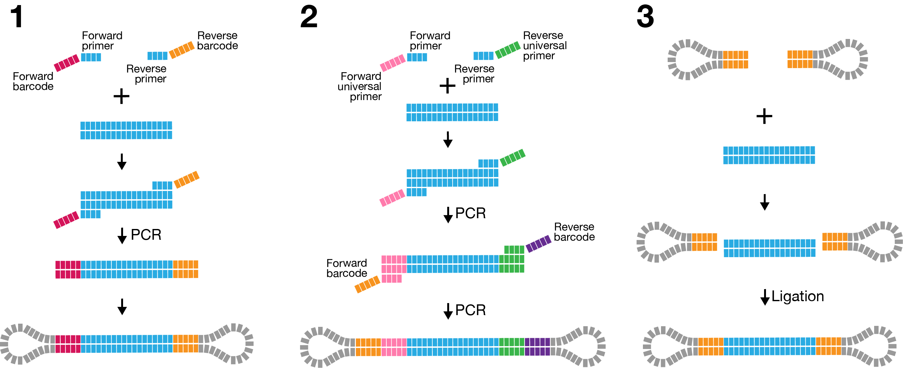

In addition, there are three different barcode library designs.
In order to describe a barcode library design, one can view it
from a SMRTbell or read perspective.
As *lima* supports raw subread and CCS read demultiplexing,
the following terminology is based on the per (sub-)read view.

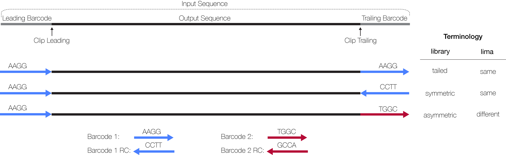

In the overview above, the input sequence is flanked by adapters on both sides.
The bases adjacent to an adapter are referred to as barcode regions.
A read can have up to two barcode regions, leading and trailing.
Either or both adapters can be missing and consequently the leading and/or
trailing region is not being called.

For the symmetric and tailed library design, the *same* barcode is attached to
both sides of the insert sequence of interest; the only difference is the
orientation of the trailing barcode. For identification, one read with a single
barcode region is sufficient.

For the asymmetric design, a *different* barcode pair is attached to the sides
of the insert sequence of interest. In order to be able to identify a
*different* barcode pair, a read with leading and trailing barcode regions
is required.

Output barcode pairs are generated from the identified barcodes.
The barcode names are combined using the `--` infix, for example `bc1002--bc1054`.
The sort order is defined by the barcode indices, lowest first.

## Features

*Lima* offers the following features:
 * Process both, raw subreads and CCS reads
 * BAM in- and output
 * Extensive reports that allow in-depth quality control
 * Clip barcode sequences and annotate `bq` and `bc` tags
 * Agnostic of input barcode sequence orientation
 * Split output BAM files by barcode
 * No scraps.bam needed
 * Full PacBio dataset support
 * Peek into the first N ZMWs and get average barcode score
 * Guess the subset of barcodes used in an input Barcode Set given a mean barcode score threshold
 * Enhanced filtering options to remove ambiguous calls

## Changelog

 * 1.6.0:
   * New filter `--min-end-score`
   * Add latest filters to summary file
   * New IsoSeq default parameters
   * Fix streaming of asymmetric BAM files
 * 1.5.0: Support spacer sequence between adapter and barcode
 * 1.4.0:
   * New filter `--min-ref-span` and `--min-scoring-regions`
   * Single-side library improvements
 * 1.3.0: --peek-guess uses only full-length ZMWs
 * 1.2.0:
   * Streaming of split BAM files
   * New fat binary build approach
 * 1.1.0: IsoSeq support
 * 1.0.0: Initial release, included in SMRT Link 5.1.0

## Execution
**Attention: Existing output files will be overwritten!**

Run on raw subread data:

    lima movie.subreads.bam barcodes.fasta prefix.bam
    lima movie.subreadset.xml barcodes.barcodeset.xml prefix.subreadset.xml

Run on CCS data:

    lima --css movie.ccs.bam barcodes.fasta prefix.bam
    lima --ccs movie.consensusreadset.xml barcodes.barcodeset.xml prefix.consensusreadset.xml

If you do not need to import the demultiplexed data into SMRT Link, it is advised
to use `--no-pbi`, omit the pbi index file, to minimize time to result.

### *Symmetric* or *Tailed* options

    Raw: --same
    CCS: --same --ccs

### *Asymmetric* options

    Raw: --different
    CCS: --different --ccs

## Input data
Input data is either raw unaligned subreads, straight from a Sequel, or
unaligned CCS reads, generated by [CCS 2](https://github.com/PacificBiosciences/unanimity);
both in the PacBio enhanced BAM format. If you want to demux RSII data, first
use SMRT Link or bax2bam to convert h5 to BAM. In addition, a `datastore.json`
with one file entry, either a SubreadSet or ConsensusReadSet, is also allowed.

Barcodes are provided as a FASTA file, one entry per barcode sequence,
**no duplicate** sequences, only upper-case bases,
orientation agnostic (forward or reverse-complement, but **NOT** reversed).
Example:

    >bc1000
    CTCTACTTACTTACTG
    >bc1001
    GTCGTATCATCATGTA
    >bc1002
    AATATACCTATCATTA

Please name your barcodes with an alphabetic character prefix to avoid
later confusion of barcode name and index. Duplicate names or sequences
are not permitted.

## Workflow
*Lima* processes input reads grouped by ZMW, except if `--per-read` is chosen.
All barcode regions along the read are processed individually.
The final per-ZMW result is a [summary](#implementation-details) over all barcode regions,
a pair of selected barcodes from the provided set of candidate barcodes;
subreads from the same ZMW will have the same barcode and barcode quality.
For a particular target barcode region, every barcode sequence gets aligned
as given and as reverse-complement, and higher scoring orientation is chosen;
the result is a list of scores over all candidate barcodes.

If only *same* barcode pairs are of interest, *symmetric/tailed*, please use
`--same` to filter out *different* barcode pairs.

If only *different* barcode pairs are of interest, *asymmetric*, please use
`--different` to require at least two barcodes to be read and remove pairs with
the same barcode.

## Output
*Lima* generates multiple output files per default, all starting with the same
prefix as the output file, omitting suffixes `.bam`, `.subreadset.xml`, and
`.consensusreadset.xml`. The report infix is `lima`.
Example:

    lima m54007_170702_064558.subreads.bam barcode.fasta /my/path/m54007_170702_064558_demux.subreadset.xml

For all output files, the prefix will be `/my/path/m54007_170702_064558_demux.`

### BAM
The first file `prefix.bam` contains clipped records, annotated with
barcode tags, that passed filters.

### Report
The second file is `prefix.lima.report`, a tab-separated file about each ZMW, unfiltered.
This report contains any information necessary to investigate the demultiplexing
process and the underlying data.
A single row contains all reads of a single ZMW. For `--per-read`, each row
contains one subread and ZMWs might span multiple rows.

### Summary
The third file is `prefix.lima.summary`, shows how many ZMWs have been filtered,
how ZMWs many are *same/different*, and how many reads have been filtered.

    ZMWs input                (A) : 213120
    ZMWs above all thresholds (B) : 176356 (83%)
    ZMWs below any threshold  (C) : 36764 (17%)

    ZMW marginals for (C):
    Below min length              : 26 (0%)
    Below min score               : 0 (0%)
    Below min end score           : 5138 (13%)
    Below min passes              : 0 (0%)
    Below min score lead          : 11656 (32%)
    Below min ref span            : 3124 (8%)
    Without adapter               : 25094 (68%)
    Undesired hybrids             : xxx (xx%) <- Only with --peek-guess
    Undesired same barcode pairs  : xxx (xx%) <- Only with --different
    Undesired diff barcode pairs  : xxx (xx%) <- Only with --same
    Undesired 5p--5p pairs        : xxx (xx%) <- Only with --isoseq
    Undesired 3p--3p pairs        : xxx (xx%) <- Only with --isoseq
    Undesired single side         : xxx (xx%) <- Only with --isoseq

    ZMWs for (B):
    With same barcode             : 162244 (92%)
    With different barcodes       : 14112 (8%)
    Coefficient of correlation    : 32.79%

    ZMWs for (A):
    Allow diff barcode pair       : 157264 (74%)
    Allow same barcode pair       : 188026 (88%)

    Reads for (B):
    Above length                  : 1278461 (100%)
    Below length                  : 2787 (0%)

Explanation of each block:

1) Number of ZMWs that went into lima,
   how many ZMWs have been passed into the output file,
   and how many did not qualify.

2) For those ZMWs that did not qualify,
   the marginal counts of each filter; each filter is explained in great detail
   elsewhere in this document.

3) For those ZMWs that passed, how many have been flagged as having a
   *same* or *different* barcode pair. And what is the coefficient of variation
   for the barcode ZMW yield distribution in percent.

4) For all input ZMWs, how many allow calling a *same* or *different*
   barcode pair. This a simplified version of, how many ZMWs have at least one
   full pass to allow a *different* barcode pair call and how many ZMWs have
   at least half an adapter, allowing a *same* barcode pair call.

5) For those ZMWs that qualified, list the number of reads that are above and
   below the provided `--min-length` threshold  (details see [here](#filter)).

### Counts
The fourth file is `prefix.lima.counts`, a tsv file, that shows the counts of each
observed barcode pair; only passing ZMWs are counted.
Example:

    $ column -t prefix.lima.counts
    IdxFirst  IdxCombined      IdxFirstNamed  IdxCombinedNamed  Counts
    1         1                bc1002         bc1002            113
    14        14               bc1015         bc1015            129
    18        18               bc1019         bc1019            106

### Clipped regions
Using the option `--dump-clips`, clipped barcode regions are stored in the file
`prefix.lima.clips`.
Example:

    $ head -n 6 prefix.lima.clips
    >m54007_170702_064558/4850602/6488_6512 bq:34 bc:11
    CATGTCCCCTCAGTTAAGTTACAA
    >m54007_170702_064558/4850602/6582_6605 bq:37 bc:11
    TTTTGACTAACTGATACCAATAG
    >m54007_170702_064558/4916040/4801_4816 bq:93 bc:10

### Removed records
Using the option `--dump-removed`, records that did not pass provided thresholds
or are without barcodes, are stored in the file `prefix.lima.removed.bam`.

### DataSet
One DataSet, SubreadSet or ConsensusReadset, is generated per output BAM file.

### PBI
One PBI file is generated per output BAM file.

## Performance
### Positive predictive values
Performance is measured as positive predictive value (PPV); it measures TP/(TP+FP),
the ratio of true positive calls over all true and false positive calls.
It informs us how much cross-calling has been observed between the desired
barcode pairs. It is also known as precision.
In order to compute a PPV, distinct amplicons of known lengths and origin are barcoded,
sequenced, demultiplexed, and mapped back to the set of known references.
With this approach, true and false positive calls can be counted per barcode pair.
The resulting PPV is due to misidentification by the demultiplexing
algorithm, caused by many different external factors, such as
poorly synthesized barcode molecules, contamination between barcode wells,
and insert contamination during the library preparation.

Depending on the barcoding mode, same or different barcodes on the ends of the
insert, and the number of barcodes used, PPV varies.

Examples for different barcoding schemes, (x) indicating use of a barcode pair:

8-plex same / symmetric

|BCs|A|B|C|D|E|F|G|H|
|-|-|-|-|-|-|-|-|-|
|A|x| | | | | | | |
|B| |x| | | | | | |
|C| | |x| | | | | |
|D| | | |x| | | | |
|E| | | | |x| | | |
|F| | | | | |x| | |
|G| | | | | | |x| |
|H| | | | | | | |x|

28-plex different / asymmetric

|BCs|A|B|C|D|E|F|G|H|
|-|-|-|-|-|-|-|-|-|
|A| |x|x|x|x|x|x|x|
|B| | |x|x|x|x|x|x|
|C| | | |x|x|x|x|x|
|D| | | | |x|x|x|x|
|E| | | | | |x|x|x|
|F| | | | | | |x|x|
|G| | | | | | | |x|
|H| | | | | | | | |

36-plex same+different / symmetric+asymmetric

|BCs|A|B|C|D|E|F|G|H|
|-|-|-|-|-|-|-|-|-|
|A|x|x|x|x|x|x|x|x|
|B| |x|x|x|x|x|x|x|
|C| | |x|x|x|x|x|x|
|D| | | |x|x|x|x|x|
|E| | | | |x|x|x|x|
|F| | | | | |x|x|x|
|G| | | | | | |x|x|
|H| | | | | | | |x|


Following libraries contain 2kb amplicons with vector-sequence-specific primers amplified.
Sequencing movies are 6 hours long with additional 2 hours pre-extension.
The instrument version is 5.0.0 and the chemistry is S/P2-C2. For each ZMW,
all sequenced barcode regions were respected.

|Design|Plex|PPV %|
|-|-|-|
|Symmetric|8|99.7|
||16|99.7|
||40|99.6|
||48|99.5|
||96|99.4|
||384|99.1|
|Asymmetric|28|98.8|
||384|97.0|
|Sym+Asym|36|90.6|

**Results:**
1. With increasing number of barcodes, PPV decreases.
2. Same barcode pair libraries have higher PPV than different barcode pair libraries.
3. Mixing same and different barcode pairs in one library leads to very bad PPV and is *not supported*.

### Yield
The yield is, after the PPV, the next most important metric. Lima removes unwanted
barcode pairs that are undesired to increase PPV, accepting a decrease in yield.

Example 384-plex symmetric (look at the bars above the x-axis):

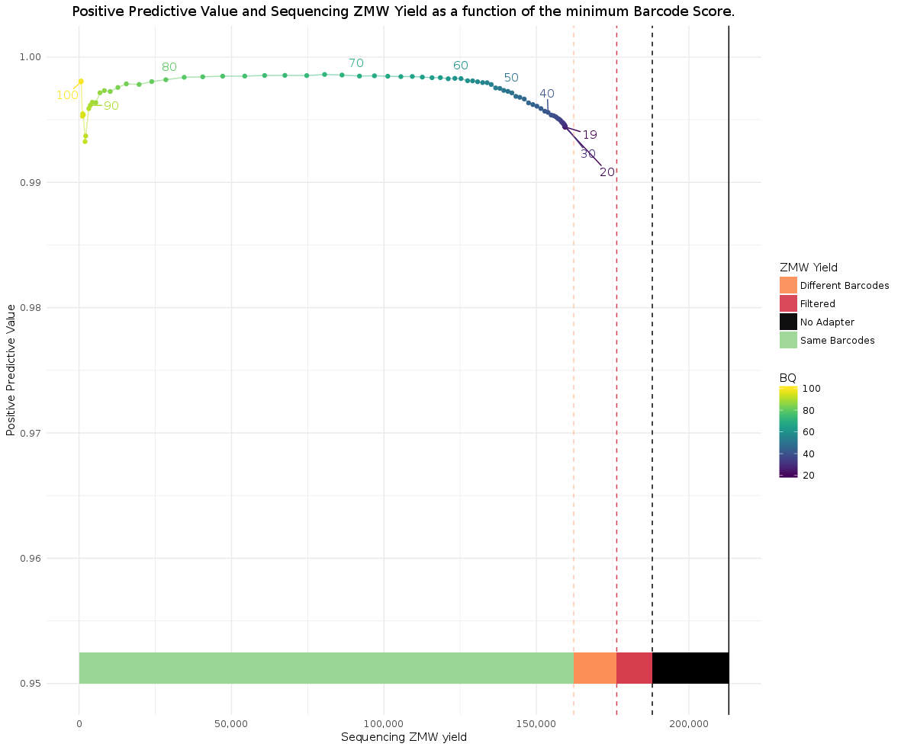

Compare it to a 384-plex asymmetric run:

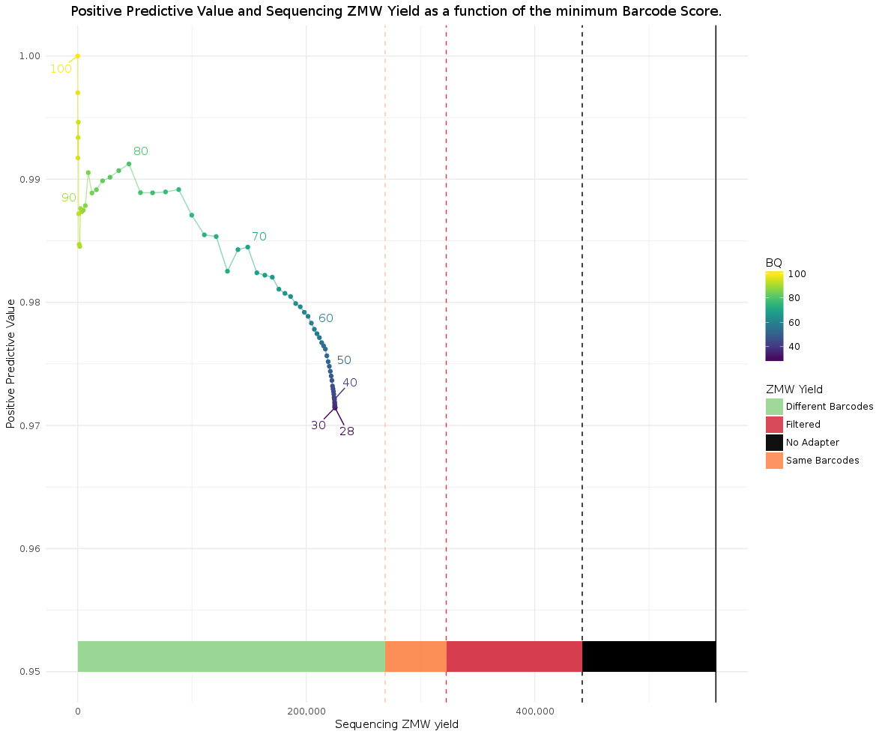

The reason behind the yield decrease for asymmetric is, in order to identify a
ZMW as asymmetric, both flanking barcodes of an insert have to be observed;
ZMWs whose polymerase read does not contain at least two adapters have to be
removed. In contrast, for the symmetric case, it is sufficient to see a single
barcode region.

## Filter
*Lima* offers a set of options for processing, including trivial and
 sophisticated filters.

### `--min-length`
Reads with length below `N` bp after demultiplexing are omitted. The default is `50`.
ZMWs with no reads passing are omitted.

### `--max-input-length`
Reads with length above `N` bp are omitted for scoring in the demultiplexing
step. The default is `0`, meaning deactivated.

### `--min-score`
Threshold for the average barcode score of the leading and trailing ends.
ZMWs with barcode score below `N` are omitted. The default is `0`.
It is advised to set it to `26`.

### `--min-end-score`
This threshold is applied to the two individual barcode scores, the leading and
trailing barcode.
ZMWs with at least one individual barcode score below `N` are omitted.
The default is `0`.

Simplified example: A ZMW is tagged with two barcodes `A` and `B`.
All leading barcode regions match to `A` with score `90` and
all trailing barcode regions match `B` with score `30`.
On average, the barcode score is `(90+30)/2=60`. Option `--min-end-score`
filters on an individual barcode level, checking `90` and `30`.
Using `--min-end-score 45`, this ZMW would not pass, because `B` is below the
threshold.

This filter can be used to remove ZMWs that have one good and one bad call,
only useful for asymmetric barcoding schemes with *different* barcodes in a pair.
For libraries with the *same* barcode in pair, this option is identical to
`--min-score`.

### `--min-ref-span` && `--min-scoring-regions`
Those options are used in combination to remove ZMWs that have spurious barcode
hits.
Option `--min-ref-span` defines the minimum reference span relative to
the barcode length to call a barcode region *scoring*.
Option `--min-scoring-regions` defines the minimum number of *scoring* barcode
regions. ZMWs with less than `-min-scoring-regions N` *scoring* regions are
omitted.

### `--min-passes`
ZMWs with less than `N` full passes, a read with a leading and
trailing adapter, are omitted. The default is `0`, no full-pass needed. Example

    0 pass  : insert - adapter - insert
    1 pass  : insert - adapter - INSERT - adapter - insert
    2 passes: insert - adapter - INSERT - adapter - INSERT - adapter - insert

### `--max-scored-barcode-pairs`
Only use up to first `N` barcode pair regions for barcode identification.
The default is `0`, deactivated filter. This is equivalent to the
maximum number of scored adapters in bam2bam.

### `--max-scored-barcodes`
Only use up to first `N` barcode regions for barcode identification.
The default is `0`, deactivated filter. Setting to 1 enables single-pass
and single-barcode calculation.

### `--max-scored-adapters`
Only use the flanking regions of up to first `N` adapters for barcode identification.
Only full adapters, surrounded by subreads, are used.
The default is `0`, deactivated filter. Setting to 1 enables single-pass barcode
calculation using forward and reverse pass.

Caution: If a subread between two full flanking adapters gets removed in PPA,
*lima* will score frankstein flanking barcodes for two consecutive subreads
with what it believes one adapter in the middle.

### `--score-full-pass`
Only use reads flanked by adapters on both sides for barcode identification,
full-pass reads.

### `--keep-idx-order`
Per default, the two identified barcode idx are sorted ascending, as in raw data,
the correct order cannot be determined. This affects the `bc` tag, `prefix.counts`
file, and `--split-bam` file names; `prefix.report` columns `IdxLowest`,
`IdxHighest`, `IdxLowestNamed`, `IdxHighestNamed` will have the same order as
`IdxFirst` and `IdxCombined`. This option only makes sense for single read data,
such as CCS.

If you are using an asymmetric barcode design with `NxN` pairs
and your input is CCS, you can use `--keep-idx-order` to preserve
the order. If your input is raw subreads and you use `NxN` asymmetric pairs,
there is no way to distinguish between pairs `bc1001--bc1002` and `bc1002--bc1001`.

### `--per-read`
Score and tag per subread, instead per ZMW.

### `--window-size-mult`
The candidate region size multiplier: `barcode_length * multiplier`, default `1.5`.
Optionally, you can specify the region size in base pairs with `--window-size-bp`.

### Alignment options

    -A,--match-score        Score for a sequence match.
    -B,--mismatch-penalty   Penalty for a mismatch.
    -D,--deletion-penalty   Deletions penalty.
    -I,--insertion-penalty  Insertion penalty.
    -X,--branch-penalty     Branch penalty.

### `--ccs`
Set defaults to `-A 1 -B 4 -D 3 -I 3 -X 1`

### `--peek`
The option `--peek N` allows to look at the first `N` ZMWs of the input and
return the mean barcode score. This allows to test multiple test `barcode.fasta`
files and see which set of barcodes has been used.

### `--guess`
The option `--guess N` performs demultiplexing twice. In the first iteration,
all barcodes are tested per ZMW. Afterwards, the barcode pair occurrences are counted
and their mean barcode score is tested against the provided threshold `N`;
only those barcode pairs that pass this threshold are used in the second round.
In this second round of demultiplexing, only barcodes from the selected
barcode pairs are being tested for each ZMW. Finally, only ZMWs from barcode
pairs that were selected in the first round, are included in the BAM output.
Both `--same` and `--different` are being respected and can be used as
additional filters.

A `prefix.lima.guess` file shows the decision process. Example:

    $ column -t *guess
    IdxFirst  IdxCombined  IdxFirstNamed  IdxCombinedNamed  NumZMWs  MeanScore  Picked
    0         0            bc1002         bc1002            174      76         1
    0         4            bc1002         bc1048            1        43         0
    9         9            bc1080         bc1080            3        16         0
    10        10           bc1093         bc1093            742      75         1
    10        14           bc1093         bc1115            2        55         1
    12        12           bc1101         bc1101            4        18         0

### `--guess-min-count`
The minimum ZMW abundance to whitelist a barcode. This filter is `AND`ed with
the minimum barcode score provided by `--guess`. The default is 0.

### `--peek` && `--guess`
The optimal way is to use both advanced options in combination, e.g.,
`--peek 1000 --guess 45`. *Lima* will run twice on the input data.
For the first 1000 ZMWs, *lima* will guess the barcodes and store the mask of
identified barcodes.
In the second run, the barcode mask is used to demultiplex all ZMWs.

### `--peek-guess`
Equivalent to the `Infer Barcodes Used parameter` option in SMRT Link.
Sets the following options:
`--peek 35000 --guess 45 --guess-min-count 10`.

### `--single-side`
Identify barcodes in molecules that only have barcodes adjacent to one adapter.
This approach makes no assumption about an alternating pattern of barcoded and
barcode-free adapters. In contrast, a 1D k-means similar to the original Lloyd
algorithm is employed to identify two clusters to separate low- and high-scoring
barcode regions. This method does not suffer from irregular adapter calls, but
the additional flexibility might lead to yet-unknown problems.

For this mode, high-scoring barcode regions are whitelisted. Only whitelisted
barcode regions contribute to the final mean barcode score and to the
calculation of `--min-score-lead`.

### `--scored-adapter-ratio`
Minimum ratio of scored vs sequenced adapters. The default is `0.25`.

### `--enforce-first-barcode`
Set the first barcode to be barcode index 0.

## Mechanical options
### `--num-threads`
Spawn a threadpool of `N` threads.
The default is `0`, meaning all available cores.
This option also controls the number of threads used for BAM and PBI compression.

### `--chunk-size`
By default, each thread consumes `N` ZMWs per chunk for processing.
The default is `10`.

### `--no-bam`
Do not produce BAM output, nor PBI. Useful if only the reports are of interest,
as time to results is lower.

### `--no-reports`
Do not produce any reports. Useful if only the demultiplexed BAM is of interest.

## Quality Control
For quality control, we offer three R scripts to help you troubleshoot your
data. The first two are for low multiplex data.
The third is for high plex data, easily showing 384 barcodes.

### `report_detail.R`

The first is for the `lima.report` file: `scripts/r/report_detail.R`. Example:

    $ Rscript --vanilla scripts/r/report_detail.R prefix.lima.report

The second, optional argument is the output file type `png` or `pdf`, with
`png` as default:

    $ Rscript --vanilla scripts/r/report_detail.R prefix.lima.report pdf

You can also restrict output to only barcodes of interest, using the barcode
name not the index.
For example, all barcode pairs that contain the barcode "bc1002":

    $ Rscript --vanilla scripts/r/report_detail.R prefix.lima.report png bc1002

A specific barcode pair "bc1020--bc1045"; note that, the script will look for both
combinations "bc1020--bc1045" and "bc1045--bc1020":

    $ Rscript --vanilla scripts/r/report_detail.R prefix.lima.report png bc1020--bc1045

Or any combination of those two:

    $ Rscript --vanilla scripts/r/report_detail.R prefix.lima.report pdf bc1002 bc1020--bc1045 bc1321

#### Yield
Per-barcode base yield:


Per-barcode read yield:

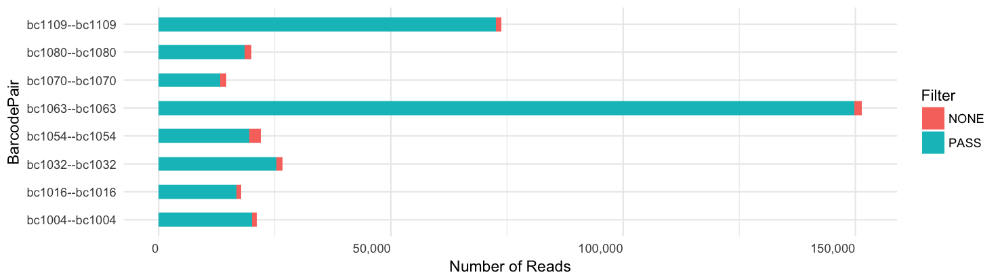

Per-barcode ZMW yield:
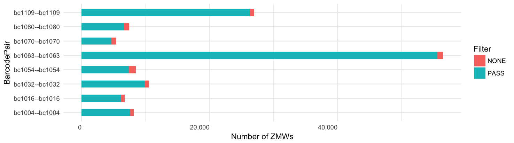

#### Scores
Score per number of adapters (lines) and all adapters (histogram).
[What are half adapters?](#what-are-half-adapters)

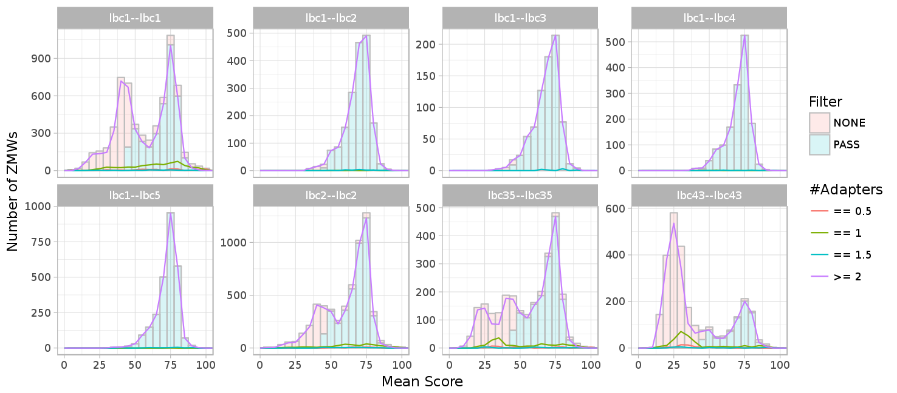

Read length vs. mean score (99.9% percentile)
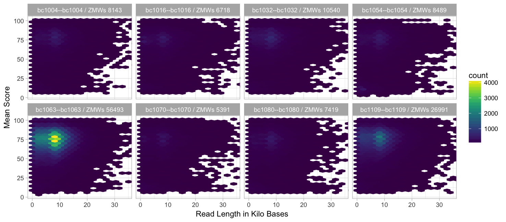

HQ length vs. mean score (99.9% percentile)
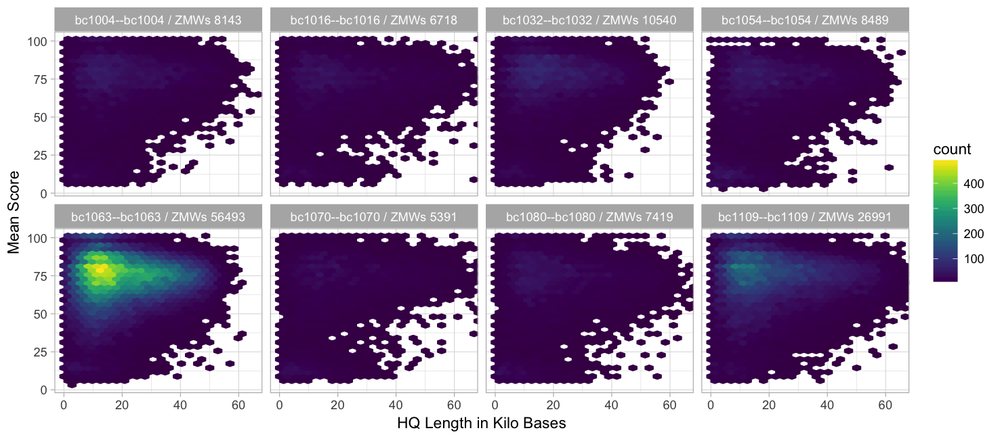

#### Read length (99.9% percentile, 1000 binwidth)
Grouped by barcode, same y-axis :

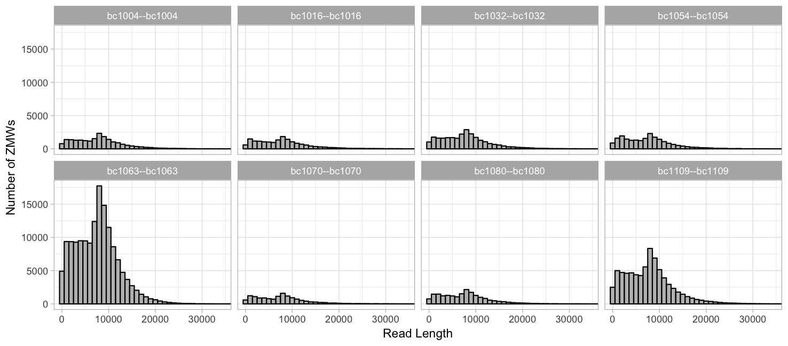

Grouped by barcode, free y-axis:

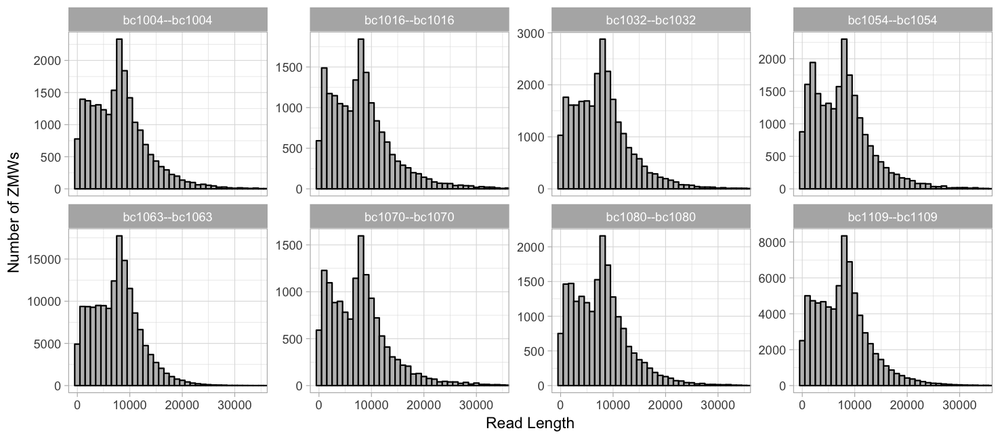

Not grouped into facets, line histogram:

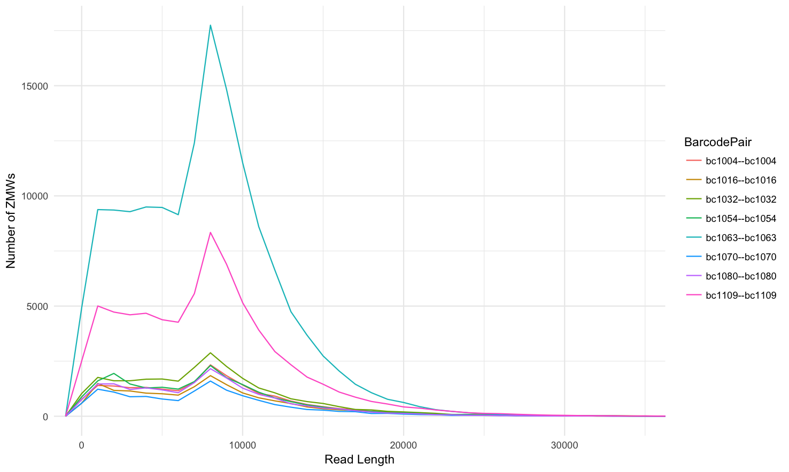

Barcoded vs. non-barcoded:

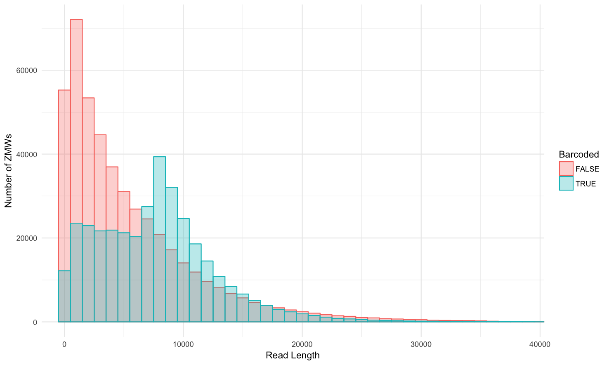

#### HQ length (99.9% percentile, 2000 binwidth)
Grouped by barcode, same y-axis:

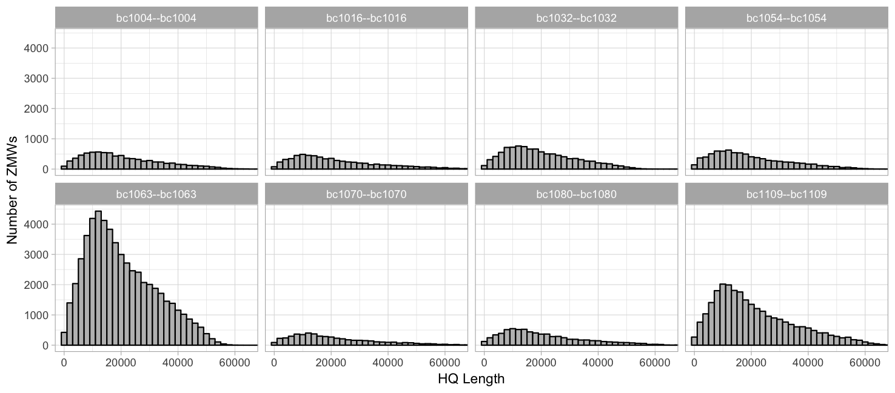

Grouped by barcode, free y-axis:

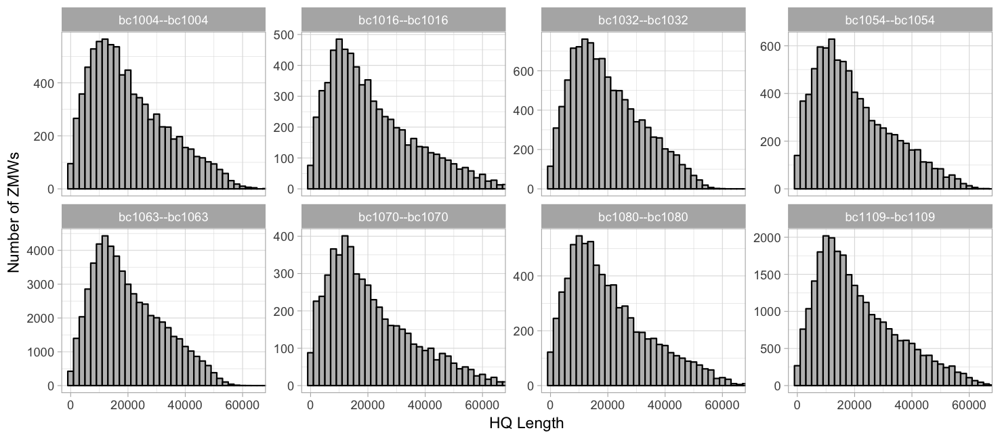

Not grouped into facets, line histogram:

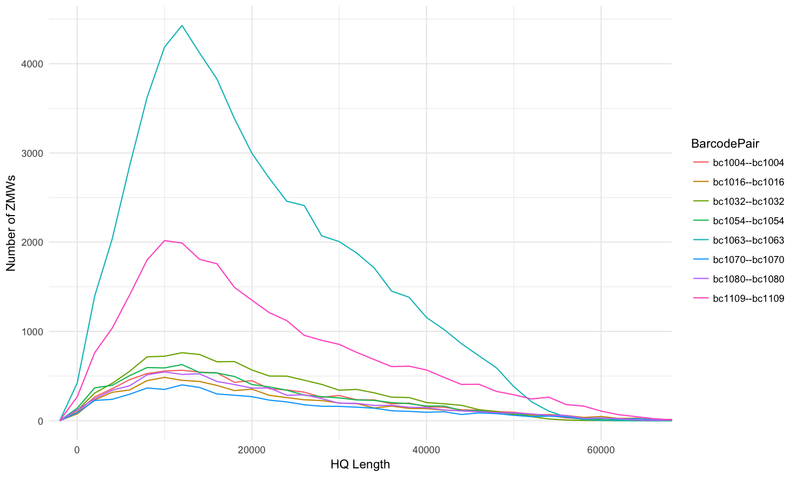

Barcoded vs. non-barcoded:

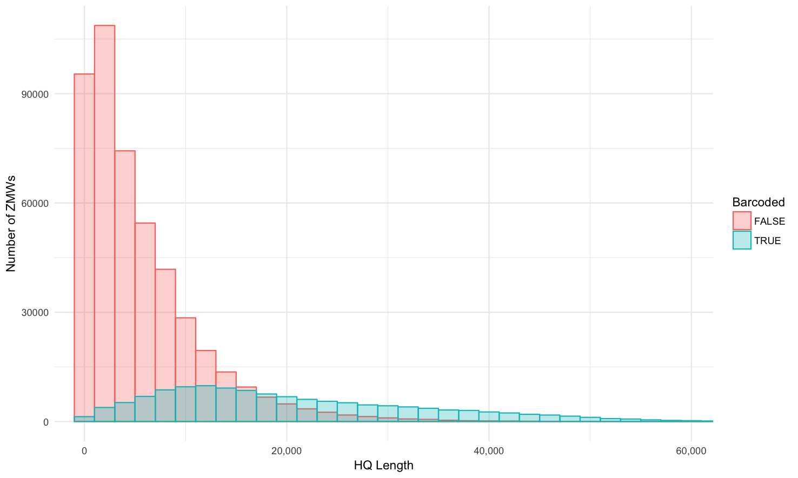

#### Adapters  (99.9% percentile, 1 binwidth)
Number of adapters:

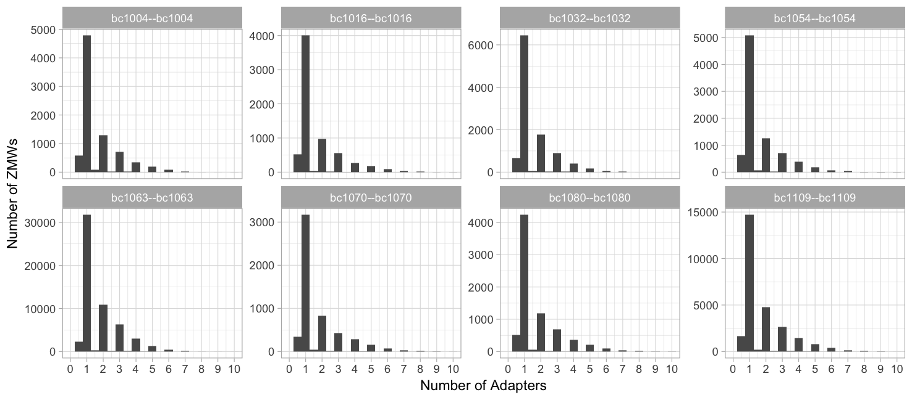

### `counts_detail.R`

The second is for multiple `counts` files: `scripts/r/counts_detail.R`.
This script cannot be called from the CLI yet, to be implemented.

#### ZMW Counts
Single plot:

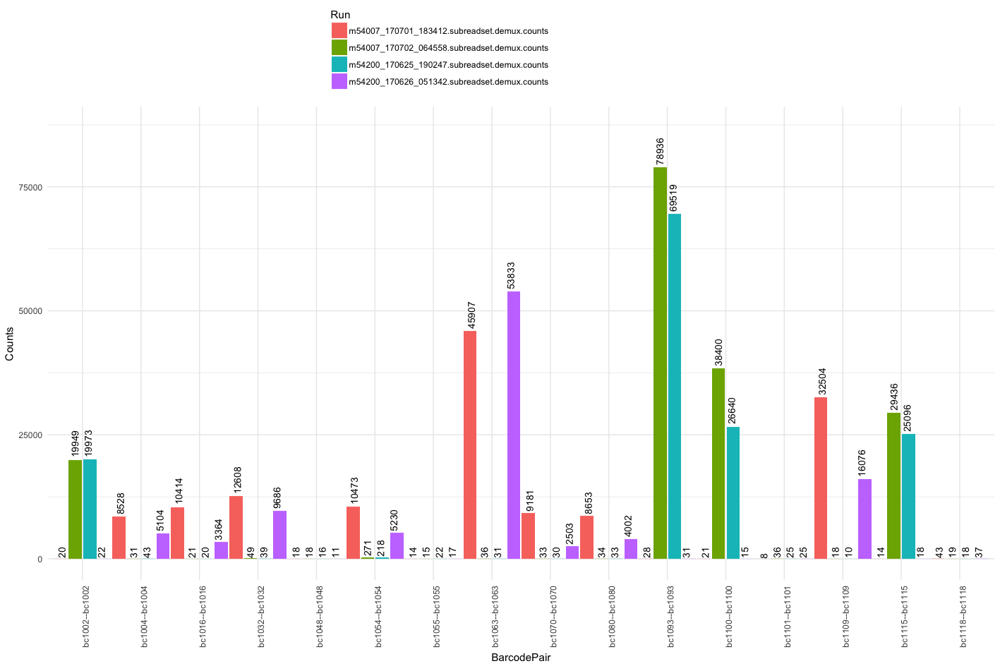

Grouped by barcode into facets:

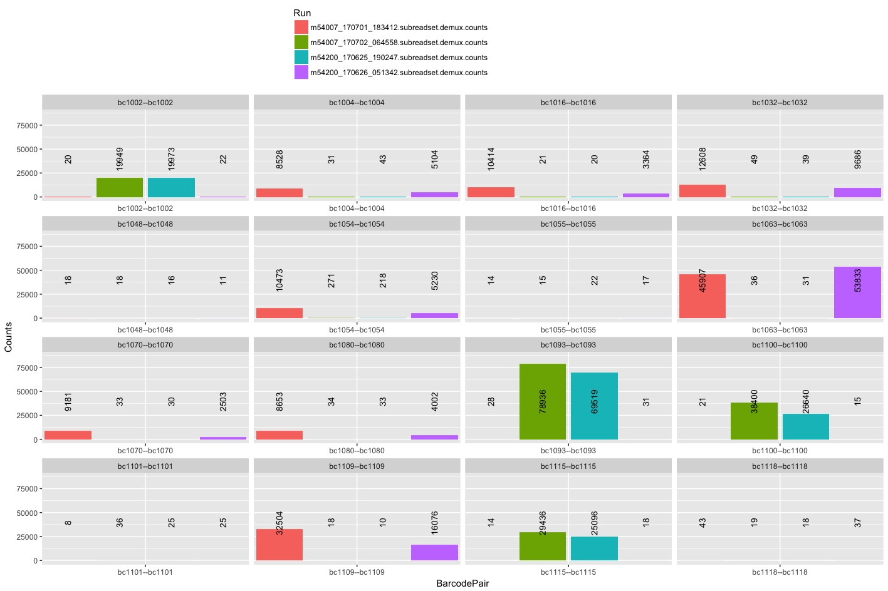

### `report_summary.R`
The third script is for high-plex data in one `lima.report` file:
`scripts/r/report_summary.R`.

Example:

    $ Rscript --vanilla scripts/r/report_summary.R prefix.lima.report

Yield per barcode:

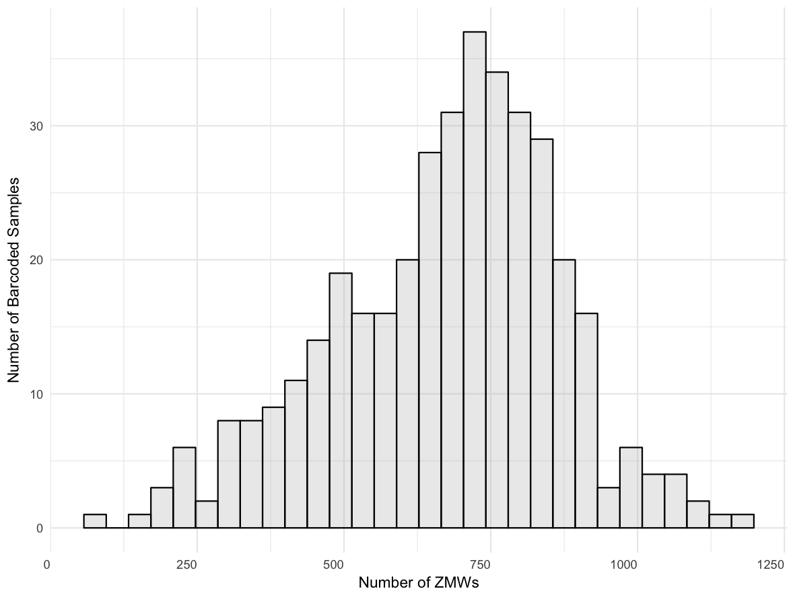

Score distribution across all barcodes:

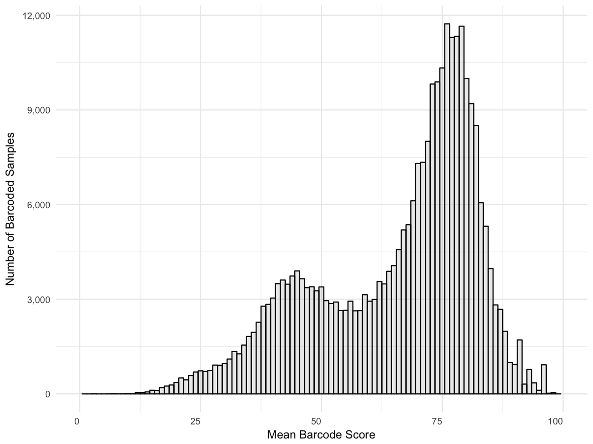

Score distribution per barcode:

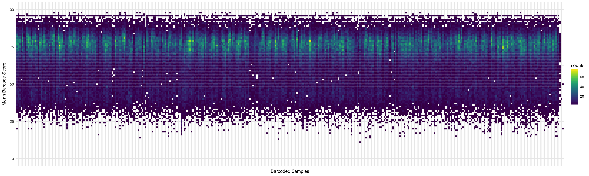

Read length distribution per barcode:

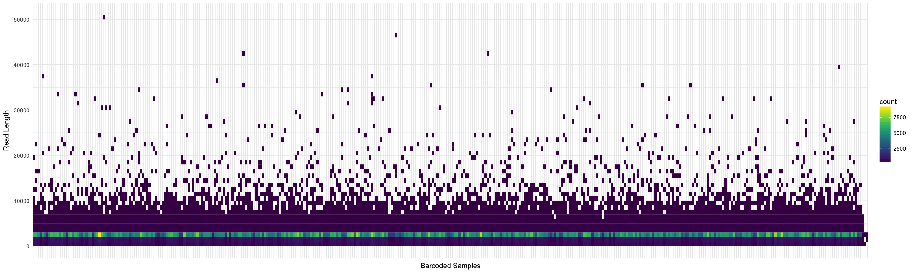

HQ length distribution per barcode:

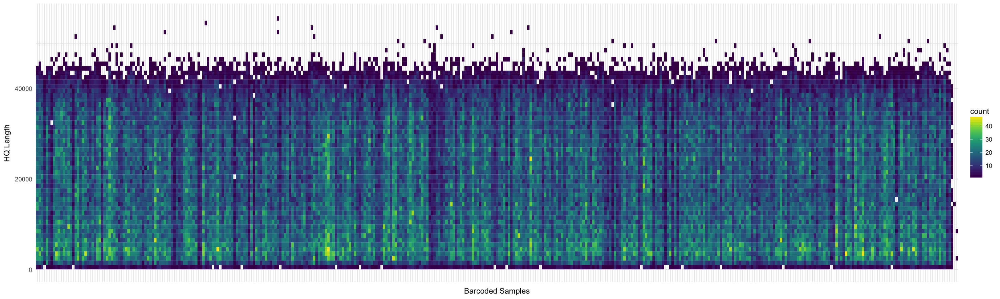

## Implementation details
### Smith-Waterman 101
Barcode score and clipping position are computed by a Smith-Waterman algorithm.
The dynamic-programming matrix has the barcode on the vertical and the target
sequence on the horizontal axis. The initialization of the first row and column
follows a glocal alignment; global in the reference, local in the query.
The best score is determined by chosing the maximum in the last row, which is
also the clipping position. This allows us to skip overhang from the adapter
or alien DNA like primer IDs or known as molecular identifiers.

|   |    | R | E | F | E | R | E | N | C | E |
|---|:---:|:---:|:---:|:---:|:---:|:---:|:---:|:---:|:---:|:---:|
|   |  0 | 0 | 0 | 0 | 0 | 0 | 0 | 0 | 0 | 0 |
| B | -1 |   |   | x |   |   |   |   |   |   |
| A | -2 |   |   |   | x |   |   |   |   |   |
| R | -3 |   |   |   |   | x |   |   |   |   |
| C | -4 |   |   |   |   | x |   |   |   |   |
| O | -5 |   |   |   |   |   | x |   |   |   |
| D | -6 |   |   |   |   |   |   | x |   |   |
| E | -7 |   |   |   |   |   |   | **x** |   |   |

For the trailing barcode region, the sequence of the reference window gets
reverse-complemented and the clipping position gets transformed back into the
correct coordinate system.


### Barcode score
The barcode score is an indicator how well the chosen barcode pair matches.
After identifying the highest barcode score, it gets normalized:

    (100 * sw_score) / (sw_match_score * barcode_length)

The range is between 0 and 100, whereas 0 is no hit and 100 perfect match.
The provided mean score is the mean of both normalized barcode scores.

## FAQ
### Why *lima* and not bam2bam?
*Lima* was developed to provide a better user experience in working with
PacBio barcoded sequencing data. Both use an identical core alignment step,
but the algorithm to identify barcode pairs and overall usability have been
improved.

### Which minimum barcode score?
The old *bam2bam* tool required a minimum barcode score threshold of `45` to
generate reliable output. This is not true for *lima*. Both, no threshold and
`26` were tested extensively with downstream applications to assure that
results are not convoluted by contaminants.
A much lower threshold can be used, because additional internal filters in
lima remove unreliable calls that go beyond simplistic min-score thresholding.

### How fast is fast?
Example: 200 barcodes, asymmetric mode (try each barcode forward and
reverse-complement), 300,000 CCS reads. On my 2014 iMac with 4 cores + HT:

    503.57s user 11.74s system 725% cpu 1:11.01 total

Those 1:11 minutes translate into 0.233 milliseconds per ZMW,
1.16 microseconds per barcode for both sides aligning forward and reverse-complement,
and 291 nanoseconds per alignment. This includes IO.

### Why doesn't *lima* utilize the maximum number of provided cores?
This might be a simple IO bottleneck. With a barcode.fasta containing only a few
barcodes, most of the time is spent reading and writing BAM files, as the barcode
identification is too fast.

### Is there a way to show the progress?
No. Please run `wc -l prefix.report` to get the number of already processed ZMWs.

### Can I have upper- and lower-case bases in my barcodes?
You can, but lima is case-insensitive and will convert them to upper case before
the alignment step.

### Can I split my data by barcode?
You can either iterate over the `prefix.bam` file N times or use
`--split-bam`. Each barcode has its own BAM file called
`prefix.idxBest--idxCombined.bam`, e.g., `prefix.0--0.bam`.

The optional parameter `--split-bam-named`, names the files by their barcode names instead
of their barcode indices. Non-word characters, anything except [A-Za-z0-9_],
in barcode names are replaced with an underscore in the file name.

This mode might consume more memory. Read the next FAQ entry for more information.

In addition, a `prefix.datastore.json` is generated to wrap the individual dataset
files.

### Why is the memory consumption really high?
Most likely this is due to `--split-bam` or `--split-bam-named` mode.
The latter is activated per default in SMRT Link.
*Lima* is able to stream up to 500 barcode pairs to individual split BAM files.
If more than 500 barcode pairs are detected, additional output is buffered first.
In this case, memory usage (RES column in top) is approximately the size of the
input, uncompressed.

The maximum concurrent output BAM file handles can be adjusted with
`--bam-handles N`. The default is 500.

Examples, how memory usage is affected by `--bam-handles`. Option
`--bam-handles-verbose` is only used to visualize the BAM output file handles.
Memory usage reported using [memusg](https://gist.github.com/netj/526585):

    $ lima input.bam barcodes.fasta out.bam --same --split-bam --bam-handles 9 --bam-handles-verbose
    Open stream 7--7
    Open stream 3--3
    Open stream 5--5
    Open stream 1--1
    Open stream 4--4
    Open stream 6--6
    Open stream 0--0
    Open stream 2--2
    Open stream 210--210
    memusg: peak=86,728

    $ lima input.bam barcodes.fasta out.bam --same --split-bam --bam-handles 4 --bam-handles-verbose
    Open stream 7--7
    Open stream 3--3
    Open stream 5--5
    Open stream 1--1
    Buffered stream 0--0
    Buffered stream 2--2
    Buffered stream 4--4
    Buffered stream 6--6
    Buffered stream 210--210
    memusg: peak=113,476

    $ lima input.bam barcodes.fasta out.bam --same --split-bam --bam-handles 0 --bam-handles-verbose
    Buffered stream 0--0
    Buffered stream 1--1
    Buffered stream 2--2
    Buffered stream 3--3
    Buffered stream 4--4
    Buffered stream 5--5
    Buffered stream 6--6
    Buffered stream 7--7
    Buffered stream 210--210
    memusg: peak=132,276

### What are half adapters?
If there is an adapter call with only one barcode region,
as the high-quality region finder cut right through the adapter,
or the preceding or succeeding subread was too short and got removed,
or the sequencing reaction started/stopped there, we call such an adapter half.
Thus, there are also 1.5, 2.5, N+0.5 adapter calls.

ZMWs with half or only one adapter can be used to identify *same* barcode pairs;
positive-predictive value might be reduced compared to high adapter calls.
For asymmetric designs with *different* barcodes in a pair, at least a single
full-pass read is required; this can be two adapters, two half-adapters, or a
combination.

### Why are *different* barcode pair hits reported in --same mode?
*Lima* tries all barcode combinations and `--same` only filters BAM output.
Sequences flanked by *different* barcodes are still reported, but are not
written to BAM. By not enforcing only *same* barcode pairs, *lima* gains
higher PPV, as your sample might be contaminated and contains unwanted
barcode pairs; instead of enforcing one *same* pair, *lima* rather
filters such sequences. Every *symmetric* / *tailed* library contains few *asymmetric*
templates. If many *different* templates are called, your library preparation
might be bad.

### Why are *same* barcode pair hits reported in the default *different* mode?
Even if your sample is labeled *asymmetric*, *same* hits are simply
sequences flanked by the *same* barcode ID.

But my design does not include *same* barcode pairs! We are aware of this,
but it happens that some ZMWs do not have sufficient signal to call a pair
with different barcodes.

### How do barcode indices correspond to the input sequences?
Input barcode sequences are tagged with an incrementing counter. The first
sequence is barcode `0` and the last barcode `numBarcodes - 1`.

### I used the tailed library prep, what options to choose?
Use `--same`.

### How can I demultiplex data with one adapter only being barcoded?
Use `--single-side`.

### What are undesired hybrids?
When running with `--peek-guess` or similar manual option combination and
different barcode pairs are found during peek, the full chip may contain
low-abundant different barcode pairs that were identified during peek
individually, but not as a pair. Those unwanted barcode pairs are called
hybrids in *lima*.

### How can I demultiplex IsoSeq data?
Even if you only want to remove IsoSeq primers, *lima* is the tool of choice.

1) Remove all duplicate sequences.
2) Annotate sequence names with a `5p` or `3p` suffix. Example:

```
    >primer_5p
    AAGCAGTGGTATCAACGCAGAGTACATGGGG
    >sample_brain_3p
    AAGCAGTGGTATCAACGCAGAGTACCACATATCAGAGTGCG
    >sample_liver_3p
    AAGCAGTGGTATCAACGCAGAGTACACACACAGACTGTGAG
```

3) Use the `--isoseq` mode; cannot be combined with `--guess`.
4) Output will be only different pairs with a `5p` and `3p` combination:

```
    demux.primer_5p--sample_brain_3p.bam
    demux.primer_5p--sample_liver_3p.bam
```

Option `--isoseq` sets following options:

```
    --split-bam-mamed
    --shared-prefix
    --min-passes 1
    --min-signal-increase 0
    --min-score-lead -1
    --match-score 2
    --mismatch-penalty 4
    --deletion-penalty 4
    --insertion-penalty 4
    --branch-penalty 3
    --min-end-score 50
    --min-scoring-regions 2
    --min-ref-span 0.75
```

Those options are very conservative to remove any spurious and ambiguous
calls, in order to guarantee that only proper asymmetric (barcoded) primer
are used in downstream analyses. Good libraries reach >75% CCS reads passing
*lima* filters.

### What is a universal spacer sequence and how does it affect demultiplexing?
For library designs that include an identical sequence between adapter
and barcode, e.g. probe-based linear barcoded adapters samples,
*lima* offers a special mode that is activated if it finds a shared prefix
sequence among all provided barcode sequences. Example:

```
    >custombc1
    ACATGACTGTGACTATCTCACACATATCAGAGTGCG
    >custombc2
    ACATGACTGTGACTATCTCAACACACAGACTGTGAG
```

In this case, *lima* detects the shared prefix `ACATGACTGTGACTATCTCA` and
removes it internally from all barcodes. Subsequently, it increases the
window size by the length `L` of the prefix sequence.
If `--window-size-bp N` is used, the actual window size is `L + N`.
If `--window-size-mult M` is used, the actual window size is `(L + |bc|) * M`.

Because the alignment is semi-global, a leading reference gap can be added
without any penalty to the barcode score.

### Why do most of my ZMWs get filtered by the score lead threshold?
The score lead measures how close the best barcode call is to the second best.
Possible solutions without seeing your data:
 * Is that sample actually barcoded?
 * Are your barcode sequences genetically too close for SMRT sequencing?
   Try CCS2 calling first and demultiplex with `--css`.
 * Are the synthesized products clean and not degenerate?
 * Did the sequencing run perform optimally, is the accuracy in the expected range?
 * Did you run lima twice, first on the original and then on the already
   demultiplexed data? This is not supported, as the barcodes have been clipped
   and removed.

Try to decrease `--score-lead`, with the potential risk of introducing
false positives.

### What is different in *lima* to *bam2bam*?
 * CCS read support
 * Barcodes of every adapter gets scored for raw subreads
 * Does not enforce symmetric barcode pairing, which increases PPV
 * For asymmetric barcodes, `lima` can report the identified order, instead of
   ascending sorting
 * Calls barcodes per barcode region and does not enforce adapter coupling
 * Nice reports for QC

## DISCLAIMER

THIS WEBSITE AND CONTENT AND ALL SITE-RELATED SERVICES, INCLUDING ANY DATA, ARE PROVIDED "AS IS," WITH ALL FAULTS, WITH NO REPRESENTATIONS OR WARRANTIES OF ANY KIND, EITHER EXPRESS OR IMPLIED, INCLUDING, BUT NOT LIMITED TO, ANY WARRANTIES OF MERCHANTABILITY, SATISFACTORY QUALITY, NON-INFRINGEMENT OR FITNESS FOR A PARTICULAR PURPOSE. YOU ASSUME TOTAL RESPONSIBILITY AND RISK FOR YOUR USE OF THIS SITE, ALL SITE-RELATED SERVICES, AND ANY THIRD PARTY WEBSITES OR APPLICATIONS. NO ORAL OR WRITTEN INFORMATION OR ADVICE SHALL CREATE A WARRANTY OF ANY KIND. ANY REFERENCES TO SPECIFIC PRODUCTS OR SERVICES ON THE WEBSITES DO NOT CONSTITUTE OR IMPLY A RECOMMENDATION OR ENDORSEMENT BY PACIFIC BIOSCIENCES.